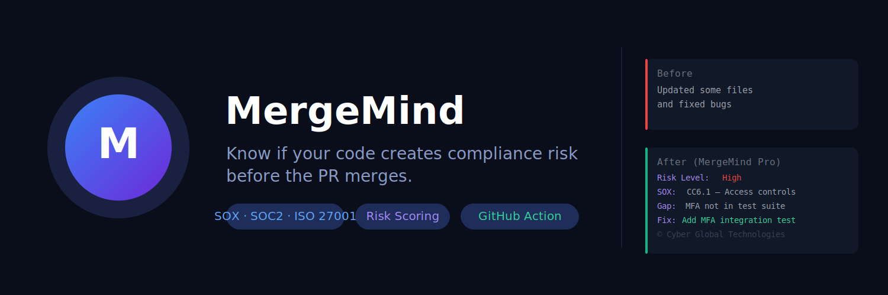

<p align="center">
  <picture>
    <source media="(prefers-color-scheme: dark)" srcset="assets/marketing/mergemind_github_banner.png">
    
  </picture>
</p>

<p align="center"><b>MergeMind analyzes pull request diffs and flags compliance risk before code is merged.</b></p>
<p align="center"><b>Built for engineering, security, and compliance teams that need audit-aware merge request reviews in GitHub Actions and GitLab CI.</b></p>

<p align="center">
  
  <a href="./LICENSE"></a>
  
</p>

---

## Product Description

MergeMind runs in GitHub Actions and GitLab CI, analyzes your pull/merge request diffs and maps code changes to compliance controls — so audit findings surface before the merge, not after the deployment.

---

## Key Features

For every pull request, MergeMind generates:

- A structured PR title and summary
- **Risk level assessment (Low / Medium / High)**
- **Compliance mapping (SOX, SOC2, ISO 27001)**
- **Control gap analysis and remediation recommendations**

---

## Before / After

**Before**

Updated some files and fixed bugs

**After (MergeMind)**

## PR Title
feat(auth): enforce MFA validation and improve session handling

## Summary
- Added MFA enforcement
- Improved session timeout logic
- Updated validation middleware

## Risk Level
High

## Compliance Mapping
- SOX: CC6.1 — Logical access controls
- SOC2: CC6.1 — Logical and physical access controls
- ISO27001: A.9.4 — System and application access control

## Control Gaps
- MFA enforcement not covered by existing test suite

## Recommendations
- Add integration tests for MFA flow before merging to main

---

## Pricing

| Feature | Free | License |
|---|---|---|
| PR title + summary | Yes | Yes |
| Risk level (Low/Med/High) | Yes | Full |
| Compliance mapping (SOX, SOC2, ISO 27001) | No | Yes |
| Control gap analysis | No | Yes |
| Remediation recommendations | No | Yes |
| Full diff analysis (no token limit) | No | Yes |

---

## MergeMind License

<p align="center">
  <a href="https://buy.stripe.com/4gM3cva2sfd54bD12ffbq08">
    
  </a>
</p>

One-time license — $29 via Stripe above · [mergemind.dev](https://mergemind.dev)

---

## How It Works

1. Purchase via Stripe
2. Receive your license key
3. Add it to your repository secrets:

> **Settings → Secrets and variables → Actions → New repository secret**

```
MERGEMIND_LICENSE_KEY=your_key_here
```

4. Open a PR — MergeMind runs automatically

---

## Getting Started

1. Add this workflow to `.github/workflows/mergemind.yml` in your repo:

```yaml
name: MergeMind PR Analysis
on:
  pull_request:
    types: [opened, synchronize, reopened]

jobs:
  analyze:
    runs-on: ubuntu-latest
    steps:
      - name: Checkout your repo
        uses: actions/checkout@v4
        with:
          fetch-depth: 0

      - name: Checkout MergeMind
        uses: actions/checkout@v4
        with:
          repository: gusinfosec/mergemind
          path: .mergemind

      - uses: actions/setup-node@v4
        with:
          node-version: 20

      - run: npm install
        working-directory: .mergemind

      - name: Run MergeMind
        run: node .mergemind/src/action.js
        env:
          GITHUB_TOKEN: ${{ secrets.GITHUB_TOKEN }}
          OPENAI_API_KEY: ${{ secrets.OPENAI_API_KEY }}
          MERGEMIND_LICENSE_KEY: ${{ secrets.MERGEMIND_LICENSE_KEY }}
          MERGEMIND_VALIDATION_URL: https://mergemind-production.up.railway.app/api/validate-key
```

2. Add your secrets under **Settings → Secrets and variables → Actions**:

```
OPENAI_API_KEY=sk-...
MERGEMIND_LICENSE_KEY=your_key
```

3. Open a PR — MergeMind runs automatically.

### Using MergeMind on GitLab CI

Copy [`examples/gitlab-ci.yml`](examples/gitlab-ci.yml) into your repo as `.gitlab-ci.yml` (or merge the `mergemind` job into your existing file). The job checks out MergeMind from GitHub into `.mergemind` and runs the analysis there, so no extra files are needed in your repo. Add these CI/CD variables under **Project → Settings → CI/CD → Variables**:

```
OPENAI_API_KEY=sk-...
MERGEMIND_GITLAB_TOKEN=glpat-...   # PAT with `api` scope (posts MR notes)
MERGEMIND_LICENSE_KEY=your_key     # optional, free tier works without it
```

For self-managed GitLab, also set `MERGEMIND_GITLAB_HOST` (defaults to `https://gitlab.com`). Open a merge request — MergeMind analyzes the diff and posts the compliance assessment as an MR note.

---

## Security

- No code stored externally
- Runs entirely within your GitHub Actions environment
- API keys stored as GitHub Secrets

---

## Contact / Support

For support, licensing, or enterprise inquiries, contact **team@mergemind.dev**.

---
© 2026 Cyber Global Technologies LLC. All rights reserved.  
Built by [Fretz Olivares](https://www.linkedin.com/in/fretz-olivares/) — [Cyber Global Technologies](https://cyberglobal.ai)  
Enterprise inquiries: info@cyberglobal.ai
